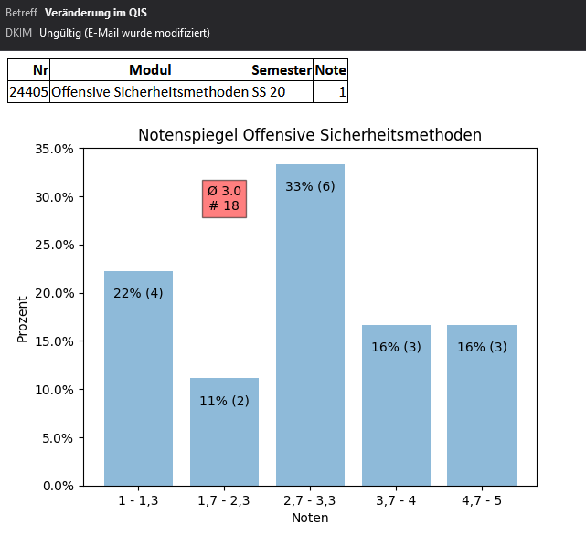

# qis

Simple Python script to check for changes on QIS.

Example of a notification received on a new grade in the system:



## Requirements

- python3
- pip

## Installation

- create virtualenv: `virtualenv env`
- activate: `source env/scripts/activate`
- run `python -m pip install -r requirements.txt`
- create initial database schema: `cat create.sql | sqlite3 module.db`

## Usage

- create and adapt config file `config.json`
- one-time execution: `python qis.py`
- regular using cronjob: `python /home/user/qis/qis.py 2>&1`

## Configuration

```json
{
    "qisLogin": {
        "username": "username",
        "password": "password"
    },
    "notification": {
        "email": true|false,
        "format": [
            {
                "header": ["Nr", "Modul", "Semester", "Note"],
                "email": ["receivemail@abc.de"]
            },
            {
                "header": ["Nr", "Modul"],
                "email": [
                    "receivemail@abc.de",
                    "receivemail@abc.de"
                ]
            }
        ],
        "sender": {
            "username": "sendermail@web.de",
            "password": "emailpassword"
        },
        "graph": true|false
    },
    "url": {
        "home_url": "https://qis.hs-albsig.de/qisserver/rds?state=user&type=0",
        "login_url": "https://qis.hs-albsig.de/qisserver/rds?state=user&type=1&category=auth.login&startpage=portal.vm",
        "logout_url": "https://qis.hs-albsig.de/qisserver/rds?state=user&type=4&re=last&category=auth.logout&breadCrumbSource=&topitem=functions",
        "verwaltung_url": "https://qis.hs-albsig.de/qisserver/rds?state=change&type=1&moduleParameter=studyPOSMenu&nextdir=change&next=menu.vm&subdir=applications&xml=menu&purge=y&navigationPosition=functions,studyPOSMenu&breadcrumb=studyPOSMenu&topitem=functions&subitem=studyPOSMenu",
        "notenspiegel_url": "https://qis.hs-albsig.de/qisserver/rds?state=notenspiegelStudent&next=list.vm&nextdir=qispos/notenspiegel/student&createInfos=Y&struct=auswahlBaum&nodeID=auswahlBaum%7Cabschluss%3Aabschl%3D84%2Cstgnr%3D1&expand=0&asi={}#auswahlBaum%7Cabschluss%3Aabschl%3D84%2Cstgnr%3D1"
    }
}
```
